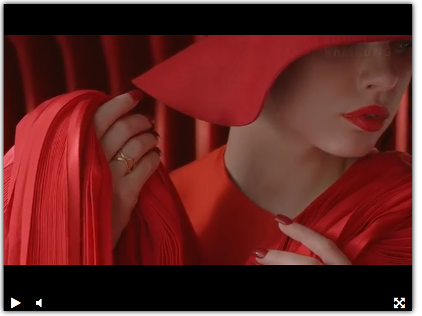

# Видеоплеер
Проект создан для обучения верстке

### Ссылка на результат
https://killla.github.io/video_player/

### Ссылка на README
https://github.com/killla/video_player/tree/master

### Скриншот

### Цель проекта

Код написан в образовательных целях на онлайн-курсе для веб-разработчиков [dvmn.org](https://dvmn.org/).